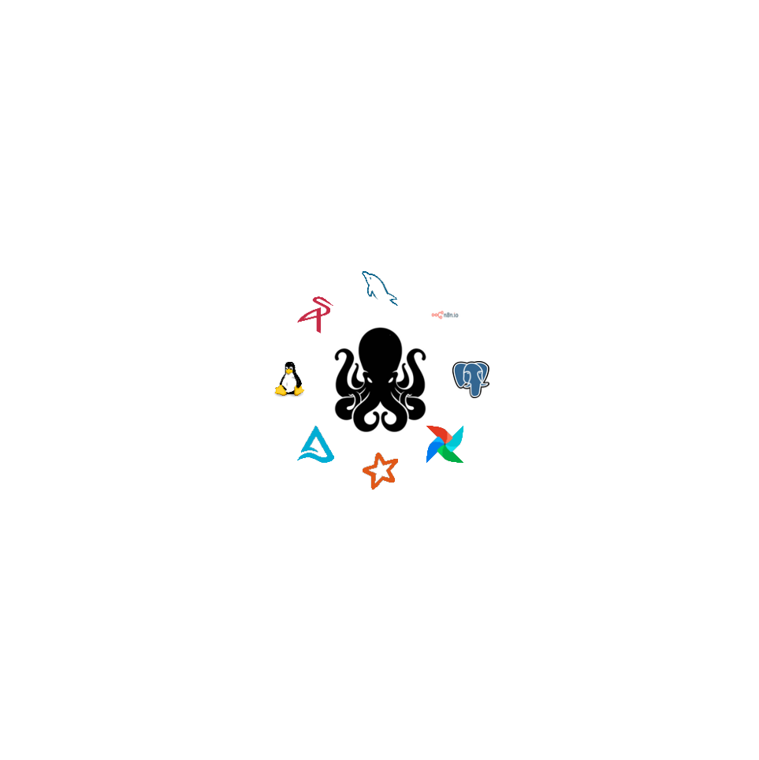

# Kraken Stack 
#### v1



O **Kraken Stack** é uma solução para desenvolvimento e gerenciamento de pipelines de dados, baseada em Docker. **Este ambiente integra diversas tecnologias** voltadas para a orquestração, processamento, armazenamento e automação de fluxos de trabalho, permitindo uma infraestrutura flexível e escalável para projetos de ciência de dados, engenharia de dados e análise de informações.

## Qual a idéia do nome Kraken Stack

No contexto do projeto, o Kraken representa uma solução robusta e integrada para o desenvolvimento e gerenciamento de pipelines de dados. O nome foi inspirado na **criatura mitológica Kraken, um monstro marinho gigante frequentemente associado a força, poder e controle sobre vastos territórios**, como a solução usa Docker que é representado por uma baleia e seus containers por simbolos ligados ao mar, dai surgiu o nome.

## Estrutura do Projeto

```
kraken/
├── docker/            # Configurações e arquivos relacionados ao Docker
    ├── airflow/       # Pasta do Airflow
        ├── dags/      # Contém as Dags do Airflow
        ├── logs/      # Contém os logs do Airflow
        ├── plugins/   # Contém os plugins do Airflow
    ├── notebooks/     # Contém os notebooks gerados no Delta Lake
├── images/            # Armazena imagens do projeto
├── menu.sh            # Script de menu interativo
├── notes.txt          # Anotações e informações do projeto
├── README.md          # Documentação do projeto
├── run.sh             # Script para iniciar a aplicação
└── stop.sh            # Script para parar a aplicação
```

## Tecnologias Utilizadas

O Kraken Stack utiliza as seguintes tecnologias para a execução dos serviços:

- **Briefer Cloud** - Análise de dados, relatórios e notebooks
- **Apache Airflow** - Orquestração de workflows
- **PostgreSQL** - Banco de dados relacional
- **Redis** - Backend de mensagens para Airflow
- **MySQL** - Banco de dados relacional
- **Apache Spark** - Processamento distribuído de dados
- **Jupyter Notebook** - Ambiente interativo para análise de dados
- **Delta Lake** - Armazenamento com capacidade ACID
- **MinIO (S3)** - Armazenamento de objetos compatível com S3
- **n8n** - Automatização de fluxos de trabalho

Esta sendo desenvolvido a adição de mais tecnologias, são as seguintes:

- **Postgres**
- **Oracle**
- **SQL Server**
- **Sybase**
- **DB2**
- **Informix**
- **Teradata**
- **Cassandra**
- **MongoDB**
- **Soluções de IA Generativa**

## Credenciais Padrão

As seguintes credenciais são utilizadas no ambiente configurado pelo `docker-compose.yml`:

- **Briefer**
  - Usuário: `a sua escolha`
  - Senha: `a sua escolha`

- **Airflow Webserver**
  - Usuário: `admin`
  - Senha: `Suc3ss0!`

- **PostgreSQL (Airflow)**
  - Usuário: `airflow`
  - Senha: `airflow`
  - Banco de Dados: `airflow`

- **MySQL**
  - Usuário root: `root`
  - Senha: `Suc3ss0!`

- **MinIO (S3)**
  - Usuário: `admin`
  - Senha: `Suc3ss0!`

- **n8n**
  - Usuário: `a sua escolha`
  - Senha: `a sua escolha`

- **PostgreSQL (n8n)**
  - Usuário: `n8n`
  - Senha: `n8npassword`

## Pré-requisitos

- Docker e Docker Compose instalados (caso não tenha baixar em https://www.docker.com/)
 
## Como Usar

Clone o repositório do GitHub

git clone https://github.com/josemarcellolopes/krakenstack.git

cd kraken

### Para inicializar a stack

```sh
./run.sh
```

### Parar a stack

```sh
./stop.sh
```

## Docker

A pasta `docker/` contém arquivos de configuração para execução do projeto dentro de containers Docker. Certifique-se de que o Docker está instalado e rodando.

## Serviços Disponíveis

O Kraken Stack contém diversos serviços, que podem ser acessados nas seguintes portas padrão:

- **Briefer Cloud**: `http://localhost:3000`
- **Apache Airflow**: `http://localhost:8080`
- **MinIO (S3) Console**: `http://localhost:9090`
- **Jupyter Notebook com Delta Lake**: `http://localhost:8888`
- **n8n**: `http://localhost:5678`

Cada serviço pode ter configurações adicionais no `docker-compose.yml`, que podem ser personalizadas conforme necessário.

## Licença

Este projeto é licenciado sob a **Licença MIT** - veja o arquivo LICENSE para mais detalhes.

## Desenvolvido por

José Marcello Lopes

www.linkedin.com/in/josemarcellolopes
